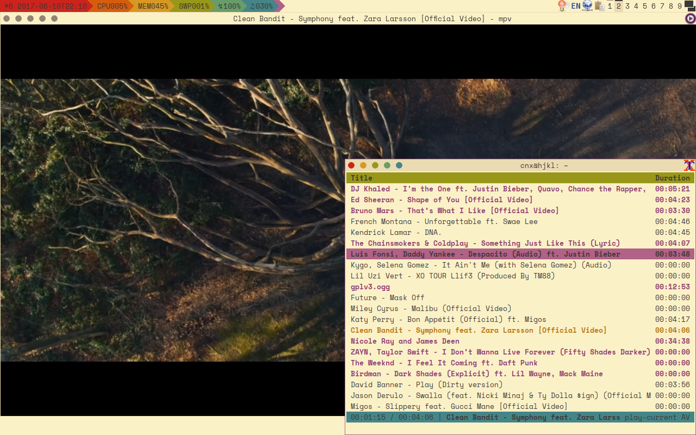

===============================
comp - Curses Omni Media Player
===============================

This program is a curses front-end for mpv and youtube-dl.

Installation
------------

comp requires Python 3.5+ with ``curses`` module (only available on Unix-like
OSes such as GNU/Linux and the BSDs) and ``libmpv``. It also depends on
``python-mpv`` and ``youtube-dl`` but the setup program will automatically 
install them if they are missing.

Using pip
^^^^^^^^^

Python 2 is still the default on most distributions so the command would be
``pip3 install comp``. You can use the ``--user`` flag to avoid system-wide
installation.

Using setup.py
^^^^^^^^^^^^^^

To install the latest version or test the development branch (called
``bachelor``, in contrast to ``master``), you'll need to do it manually::

   git clone https://github.com/McSinyx/comp.git
   cd comp
   git checkout bachelor # usually master is synced with the PyPI repo
   ./setup.py install -e .

Note ``setup.py`` uses ``setuptools`` which is a third-party module and can be
install using ``pip3``.

Usage
-----

Command line arguments
^^^^^^^^^^^^^^^^^^^^^^

::

   $ comp --help
   usage: comp [-h] [-e {json,mpv,youtube-dl}] [-c CONFIG] [--vid VID]
               [--vo DRIVER] [-f YTDL_FORMAT]
               file
   
   Curses Online Media Player
   
   positional arguments:
     file                  path or URL to the playlist to be opened
   
   optional arguments:
     -h, --help            show this help message and exit
     -e {json,mpv,youtube-dl}, --extractor {json,mpv,youtube-dl}
                           playlist extractor, default is youtube-dl
     -c CONFIG, --config CONFIG
                           path to the configuration file
     --vid VID             initial video channel. auto selects the default, no
                           disables video
     --vo DRIVER           specify the video output backend to be used. See VIDEO
                           OUTPUT DRIVERS in mpv(1) man page for details and
                           descriptions of available drivers
     -f YTDL_FORMAT, --format YTDL_FORMAT
                           video format/quality to be passed to youtube-dl

Keyboard control
^^^^^^^^^^^^^^^^

+--------------+---------------------------------------------+
|     Key      |                   Action                    |
+==============+=============================================+
| Return       | Start playing                               |
+--------------+---------------------------------------------+
| Space        | Select the current track                    |
+--------------+---------------------------------------------+
| ``/``, ``?`` | Search forward/backward for a pattern       |
+--------------+---------------------------------------------+
| ``<``, ``>`` | Go forward/backward in the playlist         |
+--------------+---------------------------------------------+
| ``A``        | Toggle mute                                 |
+--------------+---------------------------------------------+
| ``N``        | Repeat previous search in reverse direction |
+--------------+---------------------------------------------+
| ``V``        | Toggle video                                |
+--------------+---------------------------------------------+
| ``W``        | Save the current playlist under JSON format |
+--------------+---------------------------------------------+
| ``d``        | Delete current entry                        |
+--------------+---------------------------------------------+
| ``i``        | Insert playlist                             |
+--------------+---------------------------------------------+
| ``m``, ``M`` | Cycle through playing modes                 |
+--------------+---------------------------------------------+
| ``n``        | Repeat previous search                      |
+--------------+---------------------------------------------+
| ``p``        | Toggle pause                                |
+--------------+---------------------------------------------+
| ``o``        | Open playlist                               |
+--------------+---------------------------------------------+
| ``w``        | Download tracks set by playing mode         |
+--------------+---------------------------------------------+
| Up, ``k``    | Move a single line up                       |
+--------------+---------------------------------------------+
| Down, ``j``  | Move a single line down                     |
+--------------+---------------------------------------------+
| Left, ``h``  | Seek backward 5 seconds                     |
+--------------+---------------------------------------------+
| Right, ``l`` | Seek forward 5 seconds                      |
+--------------+---------------------------------------------+
| Home         | Move to the beginning of the playlist       |
+--------------+---------------------------------------------+
| End          | Move to the end of the playlist             |
+--------------+---------------------------------------------+
| Page Up      | Move a single page up                       |
+--------------+---------------------------------------------+
| Page Down    | Move a single page down                     |
+--------------+---------------------------------------------+
| F5           | Redraw the screen content                   |
+--------------+---------------------------------------------+

Configuration files
-------------------

If not specified by the ``--config``, (user-specific) configuration file is
``~/.config/mpv/settings.ini``. Default configurations
are listed below::

   [comp]
   # Initial playing mode, which can be one of these 8 modes: play-current,
   # play-all, play-selected, repeat-current, repeat-all, repeat-selected,
   # shuffle-all and shuffle-selected.
   play-mode = play-current

   [mpv]
   # Initial video channel. auto selects the default, no disables video.
   video = auto
   # Specify the video output backend to be used. See VIDEO OUTPUT DRIVERS in
   # mpv(1) man page for details and descriptions of available drivers.
   video-output =

   [youtube-dl]
   # Video format/quality to be passed to youtube-dl. See FORMAT SELECTION in
   # youtube-dl(1) man page for more details and descriptions.
   format = best
